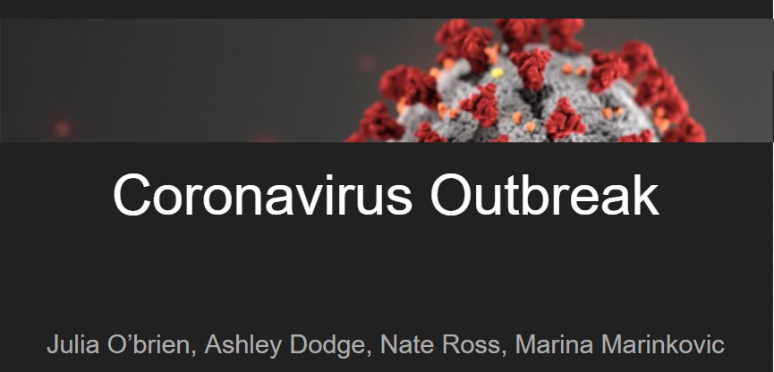
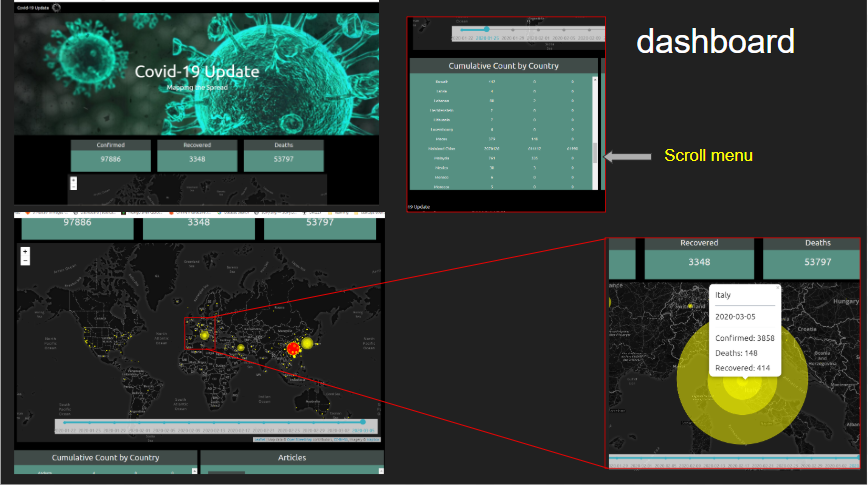

### COVID-19 : Coronavirus Outbreak

 

This project aims to create a dashboard to track COVID-19 outbreak that was initially detected in Wuhan (Hubei, China), and was declared pandemic by the WHO on Wednesday 3-11-2020.

The project consists in 1) Data manipulation (ETL) 2) dashboard creation.

Data Manupulation:
    Data Extraction: 
        original data: three csv  files from the Johns Hopkins University Center for Systems Science and Engineering (JHU CCSE) Coronavirus repository https://github.com/CSSEGISandData/COVID-19
    Data Transformation: 
        Pandas using .melt() to transform the tables and partial-pivot the DataFrame. 
    Data Loading: 
        Data was loaded to postgresSQL using sqlalchemy and the transformed table was exported as csv
Dashboard:
    To share and visualize the data, we used HTML, CSS and Bootstrap grid -> in JavaScript. 
    The dashboard has:
    Interactive map using leaflet.js library and a plugin library leaflet-timeline-slider ( https://github.com/svitkin/leaflet-timeline-slider). The data is fetched using D3, and filter by date. The data markers reflect the number of cases and is updated after changing the date.  
    The card data was first calculated and the pushed to the html using d3
    Scrolling features on the map were disabled for usability and scroll bars were added to the country count and article cards for the most updated data entry.
    We used flask to scrape for article title and date of article but because it runnes on a local server this feature can not be deploided. 

    

Data Research, Cleanup, Analysis, Machine Learning & Visualizations
* Marina Marinkovic: [LinkedIn](https://www.linkedin.com/in/marinamarinkovic/) | [GitHub](https://github.com/MPdeM)
* Julia O'Brien: [LinkedIn](https://www.linkedin.com/in/jobrien1726/) | [GitHub](https://github.com/jobrien1726)

## Front End
Website Development, AWS Storage, Visualizations & Project Management
* Ashley Dodge: [LinkedIn](https://www.linkedin.com/in/ashleydodge88/) | [GitHub](https://github.com/adodge88)

